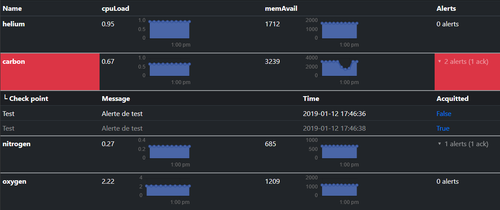

# QDMon-Webview

This is a PHP web interface for [QDMon](https://github.com/ncosnard/QDMon), which shows alerts and metrics from QDMon's SQLite database.

It also allows you to acquit an alert so that you won't receive email notifications periodically.

It requires write access to the SQLite database and its folder to update alert acquitment status.

